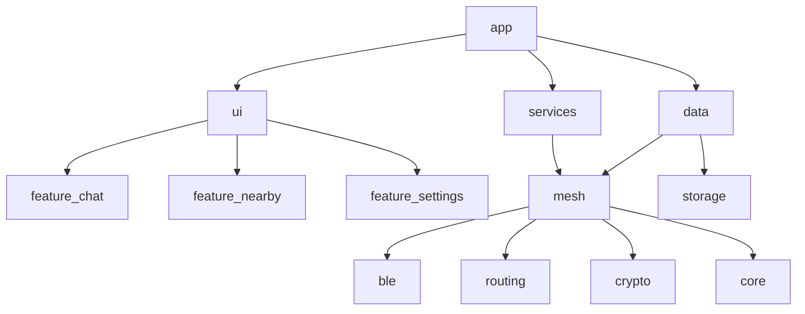
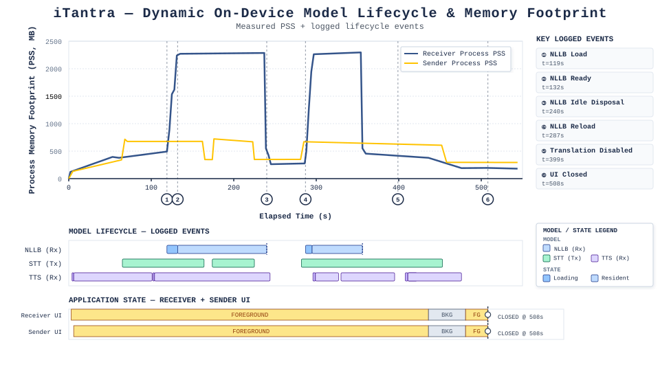

# iTantra System Architecture Report

## 1. Executive Summary
This document provides a comprehensive architectural overview of the iTantra decentralized communication mesh. Designed for disaster-stricken, connectivity-denied environments, iTantra leverages a custom BLE GATT stack, on-device AI translation, and a modular Android architecture. This report serves as internal engineering documentation, distinguishing implemented functionality from aspirational features.

## 2. System Goals
- Resilient device-to-device communication independent of traditional network infrastructure.
- Zero-latency language barrier elimination via strictly on-device processing.
- Predictable and constrained memory and battery consumption.

## 3. Project Structure & Module Breakdown
The project is built via Gradle into distinct modules to enforce separation of concerns:
- `:app` - Entry point, Dependency Injection setup, and MainActivity.
- `:ble` - Custom Bluetooth Low Energy GATT client/server and advertisement management.
- `:core` - Constants, offline language detection, and message structures.
- `:crypto` - Cryptographic primitives and ratchet session state.
- `:data` - Repositories interfacing domain logic with transport/storage.
- `:domain` - Core business use cases.
- `:mesh` - Routing logic, packet framing, and the primary `MeshEngine`.
- `:routing` - Algorithmic mesh logic (loop detection, deduping).
- `:services` - Android foreground service management.
- `:storage` - Local persistence layer.
- `:testing` - Test harnesses and simulation frameworks.
- `:ui` / `:feature-*` - Jetpack Compose presentation layer.

## 4. Dependency Graph

## 5. Build Architecture
The build utilizes Gradle Kotlin DSL (`build.gradle.kts` and `settings.gradle.kts`), structured multi-module compilation, and relies on Android build tooling for cross-module dependency resolution.

## 6. Android Components
- **Foreground Service:** `AstraMeshForegroundService` maintains the mesh background state. It survives UI termination, persisting thread execution and BLE connectivity.
- **Dependency Injection:** Handled natively via manual providers (e.g., `MeshModule`, `RepositoryModule`) scoping singletons like `MeshEngine`.
- **Lifecycle:** Adheres to Android background execution limits by leaning entirely on the foreground service classification.

## 7. Storage Layer
Handles persistence of identity, connection state, and cached messages. Interfaces are mapped via `RepositoryModule` inside `:data` and delegated to the `:storage` module.

## 8. Domain & Presentation Layers
Implemented via Jetpack Compose. State transitions flow from the domain UseCases to ViewModel StateFlows, propagating reactively to the `CommonComponents` and feature screens.

## 9. BLE Stack
The system operates a custom GATT stack rather than the Android Nearby Connections API.
- **Advertiser/Scanner:** `BleAdvertiserManager` and `BleScannerManager` handle neighbor discovery.
- **GATT Server/Client:** `GattServerManager` and `GattClientManager` orchestrate MTU negotiations, read/write characteristics, and dual-role topologies.

## 10. Packet Layer
- **Structure:** `AstraPacket` encapsulates payload, sequence numbers, TTL, hop count, source, and destination IDs.
- **Flags:** Includes definitions for emergency priority, ack requirements, and encryption.
- **Serialization:** `IthantraMessage` represents the internal semantic payload.

## 11. Routing Engine
Implemented primarily via `MeshEngine` and `:routing` utilities.
- **Algorithm:** Store-and-forward flooding to all active connections for broadcasts.
- **Loop Prevention:** Employs a bloom filter (`visitedBloomFilter`) mapped via `LoopDetector`.
- **Deduplication:** A local `deduplicationCache` ignores replayed or looped packet IDs.
- **TTL:** Emergency packets default to a TTL of 15; others use `AstraNetworkConfig.DEFAULT_TTL`.

## 12. Security
- **Key Exchange:** ECDH base key derivation.
- **Ratchet:** `AstraRatchetEngine` utilizes an HKDF symmetric chain ratchet over `AstraAead`.
- **Properties:** Achieves Perfect Forward Secrecy (PFS) by zeroing intermediate keys. However, it lacks a DH asymmetric ratchet phase, meaning it does **not** provide Post-Compromise Security (PCS).
- **Current Status:** Encryption is active in unit tests but bypassed in the live `MeshEngine.kt` transmission path.

## 13. AI Pipeline
- **VAD/STT:** Speech-to-text models loaded on demand.
- **Translation:** NLLB-200 provides translation via ONNX Runtime. `OfflineLanguageDetector` deduces source language for `Voice` packets lacking explicit metadata.
- **Memory Management:** Extreme PSS spikes (~2.2 GB) occur during NLLB loads. A strict idle timeout (60 seconds) invokes `DISPOSE` to collapse PSS back to ~260 MB. 

*Figure: Correlated receiver/sender PSS over the full test session, with model residency windows (NLLB, STT, TTS) and application UI state (foreground/background/closed) plotted on the same time axis — see the Technical Validation Report, Section 9, for full experimental methodology and numbered-marker detail.*

## 14. Resource Management & Performance Optimizations
Models load lazily and eject actively. Sub-second warm translation is theoretically supported (as ONNX sessions are kept resident) but lacks precise logcat verification.

## 15. Logging & Instrumentation
Logs use `AstraLog` with specific semantic tags (`[UI_EVENT]`, `[LIFECYCLE]`) designed to be parsed by offline analysis scripts.

## 16. Testing Strategy
- **Unit Tests:** High coverage in `:crypto` (`CryptoModuleTest.kt`) and `:core` (`AiPipelineCoreTest.kt`).
- **Simulation:** `:testing` module provides isolated simulated mesh nodes.

## 17. Error Handling & Failure Recovery
MeshEngine encapsulates errors during payload decoding and issues localized retry workers for un-ACK'd unicast messages. Failed AI models eject and allow subsequent reload attempts.

## 18. Architecture Review & Known Risks
- **Tight Coupling:** `MeshEngine` currently handles both raw transport dispatch and AI pipeline lifecycle (e.g., triggering `OfflineLanguageDetector` and translation blocks internally). This should be abstracted.
- **Dead Code / Stubs:** `AstraRatchetEngine.encrypt()` is functionally dead code in production since it is never invoked by the `MeshEngine`.
- **Missing Protocol Metadata:** Voice packets inherently lack language headers, forcing probabilistic checks.

## 19. Implementation Status

| Subsystem | Status | Justification |
| :--- | :--- | :--- |
| **Custom BLE GATT Stack** | Fully Implemented | Native GATT managers exist in `:ble`; Nearby Connections is absent. |
| **Mesh Routing & Flood** | Fully Implemented | `MeshEngine` deduplication, bloom filters, and broadcast logic are fully active. |
| **AI Translation (NLLB)** | Fully Implemented | Logs confirm 14s cold/warm memory lifecycles and ONNX residency. |
| **Symmetric Ratchet (PFS)** | Fully Implemented | `AstraRatchetEngine` performs KDF step chaining. |
| **Double Ratchet (PCS)** | Stub / Unused | Ephemeral keys remain static; no DH ratchet implemented. |
| **Mesh Payload Encryption** | Prototype / Unused | `AstraPacketFlags` marks `isEncrypted=true`, but plaintext is dispatched. |
| **Foreground Service** | Fully Implemented | Processes survive UI destruction natively. |

## 20. Future Work
- Decouple AI inference triggers from `MeshEngine`.
- Enforce the `AstraRatchetEngine` integration on the physical wire.
- Implement explicit language flags in Voice packet wire framing.
- Introduce asynchronous DH steps for full Double Ratchet compliance.
