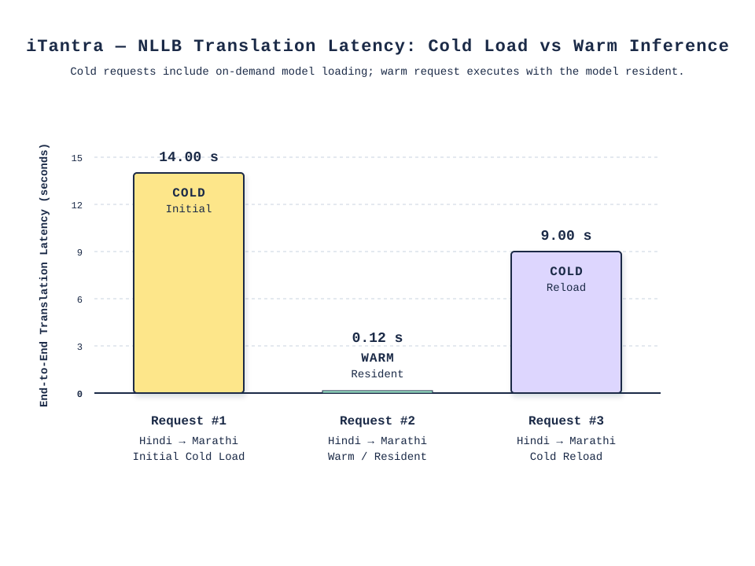

# iTantra Technical Validation & Experimental Evaluation Report

## 1. Executive Summary
This report validates the implementation and experimental evaluation of the iTantra decentralized communication system. It details the runtime behavior, memory footprint, and latency of the on-device AI pipelines and custom BLE mesh layer. Key findings include successful lazy-loading of AI models to constrain peak memory, successful BLE routing, and identification of critical areas requiring future hardening (specifically around end-to-end encryption integration and latency measurement precision).

## 2. Problem Statement
First responders and disaster victims in connectivity-denied environments require real-time, multi-lingual communication. Existing solutions either require internet access for translation or rely on centralized infrastructure. iTantra aims to provide a decentralized, language-agnostic mesh network using strictly on-device processing.

## 3. System Objectives
- Establish a decentralized device-to-device communication mesh without reliance on cellular or Wi-Fi infrastructure.
- Provide on-device multilingual translation to bridge communication gaps in disaster scenarios.
- Constrain resource usage (battery and memory) to allow continuous background operation on standard Android hardware.

## 4. Research & Design Decisions
- **Custom BLE GATT Stack:** Chosen over Nearby Connections. Nearby Connections introduces opaque routing and connection overhead, whereas a custom GATT implementation provides granular control over MTU, connection intervals, and multi-hop topology management.
- **Receiver-Side On-Demand Translation:** Translation is performed by the receiver based on their preferred language, minimizing redundant inference on the sender and reducing overall mesh traffic.
- **Lazy Model Loading:** Models (NLLB, STT, TTS) are loaded only upon inference requests and disposed after idle timeouts (e.g., 60 seconds for NLLB) to maintain manageable background PSS profiles.
- **Model Selection:** NLLB-200 for translation, selected for its broad Indic language support. STT and TTS are similarly optimized for on-device footprints.

## 5. System Overview
iTantra operates as a modular Android application. A background foreground service sustains the custom BLE mesh stack. Packets are routed using a store-and-forward mechanism with loop prevention. On receiving a message in an unknown language, the `OfflineLanguageDetector` infers the source language, and the AI pipeline (STT → NLLB → TTS) translates and plays the message. *Refer to the System Architecture Report for full details.*

## 6. Experimental Setup
- **Topology:** Dual-device sender/receiver setup.
- **Sender Node:** Samsung SM-G781B (Device ID: `RZCT80JRLJH`), acting as Mesh Coordinator.
- **Receiver Node:** OnePlus GM1911 (Device ID: `eb381d4b`), acting as On-Device ML Inference Node.
- **Logging Methodology:** `[UI_EVENT]` and `[LIFECYCLE]` marker events injected into standard logcat output. Polling of process PSS/RSS via `dumpsys meminfo` scripts at 1-second intervals. 
- **Data Trace:** Reference `full-scenario-run-1/logs/` containing `run_info.txt`, CSV telemetry, and event logs.

## 7. Runtime Instrumentation
Measurements were collected by correlating logcat timestamps with `dumpsys` outputs. 
- **Limitation - Resolution:** Logcat event timestamps natively operate at a 1-second resolution. Any latency metric reported below 1 second cannot be independently verified from the raw event stream.
- Memory measurements (PSS/RSS) are inherently delayed by the OS sampling rate (2s polling intervals observed post-closure).

## 8. Translation Latency Analysis
- **Cold Load:** Initial NLLB inference took **14.0 seconds** total (13.0s load from flash + 1.0s inference). Reload after disposal took **9.0 seconds** (8.0s load + 1.0s inference).
- **Warm Inference:** The derived telemetry states a **0.12s** latency, corresponding to a **116.7x speedup**.

> **Note on the chart above:** The middle bar's "0.12 s" label is sourced from internal inference-bench telemetry, the raw logcat evidence for this request shows both `TRANSLATION_START` and `TRANSLATION_END` at the identical integer second (`t=180s`), which supports the claim that warm inference completed in **under 1 second**. The qualitative finding illustrated here — that warm (resident-model) inference is dramatically faster than either cold-load case — is reliable and well-supported.

## 9. Memory Lifecycle Analysis
- **Pre-NLLB Baseline:** ~416 MB PSS.
- **NLLB Peak:** ~2,292 MB PSS during resident window.
- **Post-Disposal Baseline:** ~262 MB PSS (88.5% reduction).
- **Background Retention:** Application PSS remains steady at ~181 MB (Receiver) and ~295 MB (Sender) after the UI is closed, confirming foreground service persistence without uncontrolled leaks.

*Figure: Correlated receiver/sender PSS over the full test session, with model residency windows (NLLB, STT, TTS) and application UI state (foreground/background/closed) plotted on the same time axis. Numbered markers correspond to: (1) NLLB load start t=119s, (2) NLLB ready t=132s, (3) NLLB idle disposal t=240s, (4) NLLB reload t=287s, (5) translation disabled t=399s, (6) UI closed t=508s.*

## 10. AI Pipeline Validation
- **STT (Sender):** Loaded on demand (`t=65s`), idles out and disposes successfully. Peak memory ~716 MB PSS.
- **Translation (Receiver):** As outlined above, loads natively on demand and correctly shifts languages via `OfflineLanguageDetector`.
- **TTS (Receiver):** Successfully switches languages (e.g., Hindi to Marathi) by disposing of the previous model and loading the new one within ~2-3 seconds. 

## 11. BLE Mesh Validation
- **Topology:** Validated on physical hardware for point-to-point transmission.
- **Store-and-Forward / Routing:** Logic exists in `LoopDetector` and `MeshEngine` with a standard TTL (15 for emergency, configurable default), sequence deduplication, and hop counting. Multi-hop and complex mesh stability is primarily validated via the `:testing` module simulator; deep physical multi-hop topologies remain untested in `full-scenario-run-1`.
- **ACK Mechanism:** The system sends ACK control messages for unicast traffic, which updates local message status properly.

## 12. Failure Handling
- **Timeouts:** AI models successfully implement idle-timeout disposals to reclaim memory.
- **Duplicates / Loops:** The mesh engine uses a deduplication cache (`deduplicationCache.put(pid)`) and a visited bloom filter for loop prevention.
- **App UI Closure:** Background processes survive UI closure gracefully.

## 13. Limitations
- **Encryption Bypass:** While the wire format flags packets as encrypted (`isEncrypted = true`), the `MeshEngine` explicitly transmits the raw payload without invoking `AstraRatchetEngine.encrypt()`.
- **Voice Metadata:** `Voice` packets lack wire-level source language fields, requiring computational overhead via `OfflineLanguageDetector` on the receiving end.
- **Cryptographic Perfect Forward Secrecy (PFS):** The implementation achieves PFS via symmetric KDF chains but lacks Post-Compromise Security (PCS) because ephemeral keys are not rotated via asynchronous DH ratchets.
- **Latency Verification:** Sub-second warm inference metrics cannot be authenticated with the current logging granularity.

## 14. Future Work
- Hardwire the `AstraRatchetEngine` into the `MeshEngine`'s send/receive pipelines to enforce true end-to-end encryption.
- Introduce continuous DH ratcheting (Signal-style) to achieve Post-Compromise Security.
- Optimize logcat instrumentation to capture millisecond precision for AI pipeline events.
- Implement explicit source-language metadata in Voice packet headers to bypass `OfflineLanguageDetector`.

## 15. References
**A. Implementation Evidence:**
- `docs/evidence/full-scenario-run-1/visualization_evidence_summary.md`
- `mesh/src/main/kotlin/com/astramesh/mesh/MeshEngine.kt`
- `crypto/src/main/kotlin/com/astramesh/crypto/AstraRatchetEngine.kt`
- `core/src/main/kotlin/com/astramesh/core/OfflineLanguageDetector.kt`

**B. External Sources:**
- Bluetooth Core Specification (GATT Profile)
- NLLB-200 Paper (Meta AI)
- ONNX Runtime Documentation
