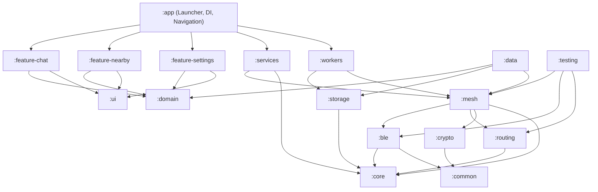

# AstraMesh System Architecture

AstraMesh is a production-grade, offline-first, decentralized mesh messaging platform engineered from first principles for Android 10+ (API 29–35).

## Architectural Philosophy

1. **Zero Centralized Infrastructure**: Nodes discover each other, form transient peer-to-peer links, negotiate cryptographic handshakes, and route multi-hop packets without cellular networks, internet access, or central servers.
2. **First-Principles Protocol Engineering**: Clean binary wire encoding, deterministic routing metric calculus, compact Bloom-filter loop detection, and sliding replay protection windows.
3. **Clean Architecture & Multi-Module Separation**: Strict separation of concerns across 16 decoupled modules, enabling independent testing, isolated compilation, and rigorous domain modeling.

---

## Multi-Module Hierarchy

### Module Responsibilities

| Module | Responsibility | Key Classes |
|---|---|---|
| `:common` | Primitive utilities, result wrappers, logging, and mathematical operations | `AstraResult`, `ByteUtils`, `Crc32`, `DispatcherProvider`, `AstraLog` |
| `:crypto` | NIST P-256 ECDH, RFC 5869 HKDF, AES-256-GCM, Double Ratchet, Anti-Replay | `AstraKeyPair`, `AstraKeyAgreement`, `AstraRatchetEngine`, `ReplayProtectionWindow` |
| `:core` | Value classes, identifiers, network configuration, and system states | `NodeId`, `PacketId`, `ChatId`, `MessageId`, `AstraNetworkConfig` |
| `:domain` | Business rules, domain models, repository contracts, and use cases | `Message`, `Chat`, `Peer`, `Route`, `SendMessageUseCase`, `EmergencyBroadcastUseCase` |
| `:routing` | Composite routing metrics, loop detection, Dijkstra path finding, routing table | `RouteMetricCalculator`, `LoopDetector`, `RoutingTable`, `ShortestPathFinder` |
| `:ble` | Android BLE Peripheral & Central management, GATT connection pool, framing | `BleFrameCodec`, `BleFrameFragmenter`, `BleFrameReassembler`, `BleConnectionPool` |
| `:mesh` | Binary packet serialization, duplicate cache, priority queue, forwarder, engine | `AstraPacket`, `DuplicateDetectionCache`, `PacketPriorityScheduler`, `MeshEngine` |
| `:storage` | Room SQLite persistence, TypeConverters, DAOs for all domain entities | `AstraDatabase`, `ChatDao`, `MessageDao`, `PeerDao`, `RouteDao`, `SessionKeyDao` |
| `:data` | Concrete implementations of domain repository interfaces linking Room & Mesh | `MessageRepositoryImpl`, `ChatRepositoryImpl`, `MeshRepositoryImpl` |
| `:services` | Persistent Android Foreground Service, WakeLock power management, Doze handling | `AstraMeshForegroundService`, `PowerOptimizationCoordinator` |
| `:workers` | WorkManager periodic background tasks (DTN queue sync, key rotation, DB pruning)| `PendingQueueSyncWorker`, `KeyRotationWorker`, `DatabasePruneWorker` |
| `:ui` | Material 3 Cyberpunk design system, typography, animations, radar indicators | `AstraTheme`, `PulsingStatusDot`, `SignalStrengthIndicator`, `AstraTopBar` |
| `:feature-chat` | Conversations list, chat bubbles, delivery state ticks, text & attachment input | `ChatListViewModel`, `ChatListScreen`, `ConversationViewModel`, `ConversationScreen` |
| `:feature-nearby` | Circular radar sweep UI, distance estimation, peer trust modification | `NearbyPeersViewModel`, `MeshTopologyViewModel`, `NearbyPeersScreen` |
| `:feature-settings`| Ephemeral NodeId display, cryptographic panic wipe, live telemetry dashboard | `SettingsViewModel`, `SettingsScreen` |
| `:testing` | In-memory RF propagation simulator, multi-node mesh simulator, E2E test suites | `VirtualBleMedium`, `VirtualMeshNode`, `MultiNodeSimulationTest` |
| `:app` | Application entry point, Hilt dependency injection graph, Compose Navigation | `AstraApplication`, `MainActivity`, `DatabaseModule`, `MeshModule` |
